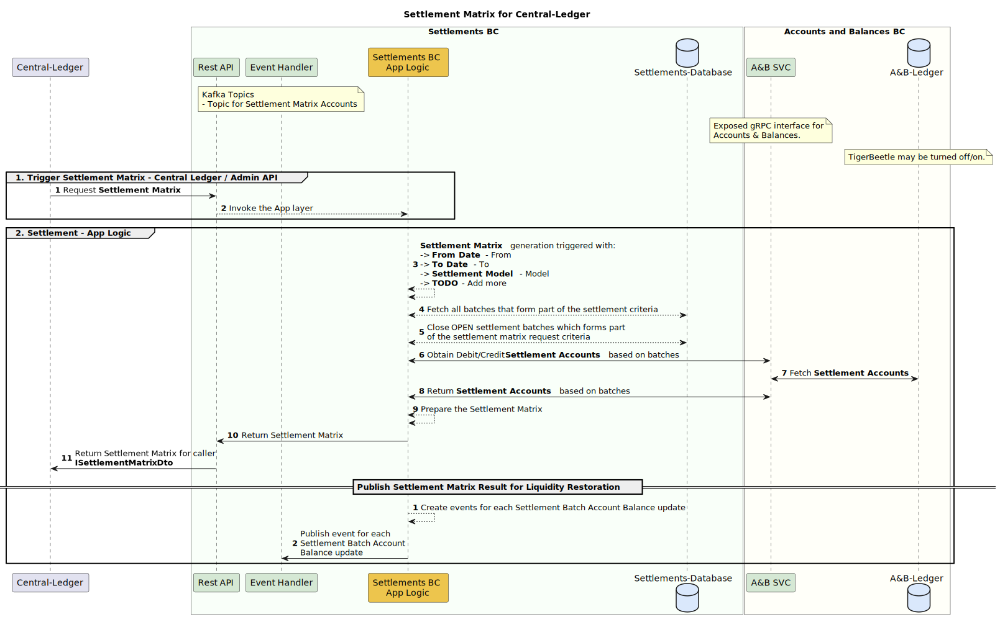
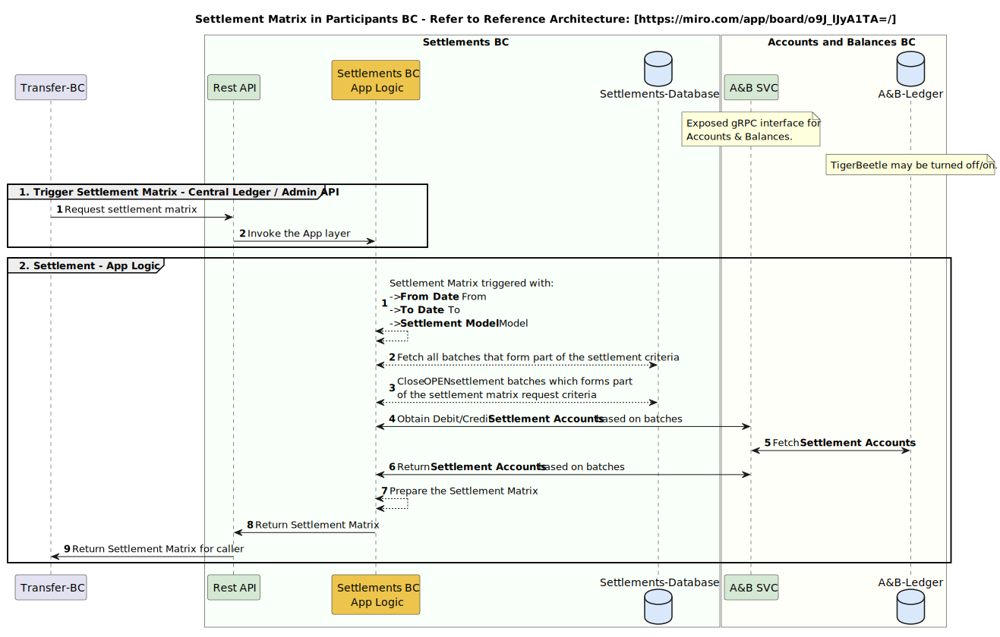

# Settlement Flows
This document describes how the Settlement BC processes settlement, including detailing how data flows during the settlement process.  
At a high level, settlement entails:
- [Creating Settlement Transfers](#1-creating-settlement-transfers) 
- [Fulfilling Settlement Obligations](#2-fulfilling-settlement-obligations) 
- [Assigning Settlement Batches](#3-assigning-settlement-batches)
- [References](#4-references)

The Settlement BC service is designed for use by one of two Mojaloop transaction clearing services.  
This is dependent on which major version of the Mojaloop software has been deployed:
- The `Central-Ledger` service records all cleared transactions for the current production Mojaloop major version 1.
- The `Transfers BC` service records all cleared transactions for the anticipated, not yet released Mojaloop major version 'vNext'. 

## 1. Creating Settlement Transfers
This process is initiated when the Settlement BC receives cleared Transfers to settle.  
The process creates settlement obligations between the payer (debtor) and payee (creditor) DFSPs 
by creating settlement transfers which are deterministically allocated to settlement batches. 

## Settlement from Transfers BC
The diagram below illustrates how Transfers that were cleared by the **Transfers BC** get settled:
## 

### Settlement from Central-Ledger
The diagram below illustrates how Transfers that were cleared by the **Central-Ledger** service get settled:
## 

### Settlement Transfer Model
A settlement transfer is the data object shared between Settlement and the external systems once the clearing transfer has been completed successfully.
The table below gives a view of the Settlement Transfer fields:

| Field              | Definition                                | Description                                                                                                                                        |
|--------------------|-------------------------------------------|----------------------------------------------------------------------------------------------------------------------------------------------------|
| `id`               | `null / string`                           | The global unique identifier for settlement transfer. Assigned by Settlement                                                                       |
| `externalId`       | `string`                                  | An external id used by the external system (Central-Ledger / Transfers BC) used to identify a transaction                                          |
| `currencyCode`     | `string`                                  | The currency code for a settlement transfer as described in ISO-4217                                                                               |
| `currencyDecimals` | `number / null`                           | The number of decimal precisions for the `currencyCode`                                                                                            |
| `amount`           | `string`                                  | The transfer amount in minor denomination format (cents/fills) as text (`string)                                                                   |
| `debitAccount`     | `ISettlementBatchAccountDto`              | The account to be debited. The actual settlement account will be derived from the provided debit account during a transfer                         |
| `creditAccount`    | `ISettlementBatchAccountDto`              | The account to be credited. The actual settlement account will be derived from the provided credit account during a transfer                       |
| `timestamp`        | `number`                                  | The timestamp of the original committed/fulfilled transfer. Settlement batch processing make use of the timestamp to allocate transfers to batches |
| `batch`            | __Optional__ `null / ISettlementBatchDto` | The settlement batch gets assigned during the settlement process, by the Settlement-BC                                                             |
* See `ISettlementTransferDto` at https://github.com/mojaloop/settlements-bc/blob/main/packages/public-types-lib/src/index.ts

### Settlement Batch Account Model
The table below gives a view of the Settlement Batch Account fields:

| Field              | Definition                                | Description                                                                                               |
|--------------------|-------------------------------------------|-----------------------------------------------------------------------------------------------------------|
| `id`               | `null / string`                           | The global unique identifier for settlement batch account. Assigned by Settlement                         |
| `externalId`       | `string`                                  | An external id used by the external system (Central-Ledger / Transfers BC) used to identify an account    |
| `settlementBatch`  | `null / ISettlementBatchDto` __Optional__ | The settlement batch the account is assigned to                                                           |
| `currencyCode`     | `string`                                  | The currency code for a settlement batch account as described in ISO-4217                                 |
| `currencyDecimals` | `number / null`                           | The number of decimal precisions for the `currencyCode`                                                   |
| `debitBalance`     | `string`                                  | The settlement account debit balance amount in minor denomination format (cents/fills) as text (`string)  |
| `creditBalance`    | `string`                                  | The settlement account credit balance amount in minor denomination format (cents/fills) as text (`string) |
| `timestamp`        | `number`                                  | The timestamp for when the settlement batch account was created                                           |
* See `ISettlementBatchAccountDto` at https://github.com/mojaloop/settlements-bc/blob/main/packages/public-types-lib/src/index.ts

## 2. Fulfilling Settlement Obligations
This process begins with requesting the settlement matrix for a specified timespan __(Generate Settlement Matrix)__.    

For open batches within the specified period of time, requesting the settlement matrix closes 
the batches and returns a result set of all the DR/CR balances of the settlement batches.  
The purpose of the matrix is to view the DR/CR balances for batches, and the payer/payee 
settlement account balances for those batches.  

Once the batches are closed, the external system (i.e. Central-Ledger, Transferes-BC, Participants-BC) 
that interfaces with the Settlement-BC gets notified of the settlement transfers being fulfilled.

### Settlement Matrix - Central-Ledger
The flow below is how a Settlement Matrix is created for Central-Ledger:
## 

## Settlement Matrix - Participants BC
The flow below is how a fulfilled Matrix is created for Participants BC:
## 

### Settlement Matrix Model
The settlement matrix is the data object shared between Settlement and the external systems during settlement matrix generation.
The table below illustrates the Settlement Matrix fields:

| Field                   | Definition                    | Description                                                        |
|-------------------------|-------------------------------|--------------------------------------------------------------------|
| `fromDate`              | `number`                      | The from date to which to generate the settlement matrix from      |
| `toDate`                | `number`                      | The from date to which to generate the settlement matrix until     |
| `settlementModel`       | `string`                      | The settlement model for which the settlement model is generated   |
| `generationDuration`    | `number`                      | The time in milliseconds it took to generate the settlement matrix |
| `batches`               | `ISettlementMatrixBatchDto[]` | The settlement matrix batches that were processed                  |
* See `ISettlementMatrixDto` at https://github.com/mojaloop/settlements-bc/blob/main/packages/public-types-lib/src/index.ts

### Settlement Matrix Batch Model
The settlement matrix batch data object is a child object for the [Settlement Matrix Model](#settlement-matrix-model)
The table below illustrates the Settlement Matrix Batch fields:

| Field              | Definition                                     | Description                                                                                             |
|--------------------|------------------------------------------------|---------------------------------------------------------------------------------------------------------|
| `batchIdentifier`  | `string`                                       | The batch matrix unique batch identifier `e.g DEFAULT.USD:USD.2023.1.24.14.28.1`                        |
| `batchStatus`      | `SettlementBatchStatus`                        | The batch status prior to the settlement matrix being generated                                         |
| `batchStatusNew`   | `SettlementBatchStatus`                        | The current batch status as a result of the settlement matrix request                                   |
| `currencyCode`     | `string`                                       | The currency code as described in ISO-4217                                                              |
| `debitBalance`     | `string`                                       | The settlement batch debit balance amount in minor denomination format (cents/fills) as text (`string)  |
| `creditBalance`    | `string`                                       | The settlement batch credit balance amount in minor denomination format (cents/fills) as text (`string) |
| `batchAccounts`    | `ISettlementMatrixSettlementBatchAccountDto[]` | The credit balance amount in minor denomination format (cents/fills) as text (`string)                  |
* See `ISettlementMatrixBatchDto` at https://github.com/mojaloop/settlements-bc/blob/main/packages/public-types-lib/src/index.ts

### Settlement Matrix Batch Account Model
The table below illustrates the Settlement Matrix Batch Account fields:

| Field              | Definition                    | Description                                                                                                     |
|--------------------|-------------------------------|-----------------------------------------------------------------------------------------------------------------|
| `id`               | `null / string`               | The global unique identifier for settlement batch account. Assigned by Settlement                               |
| `externalId`       | `string`                      | An external id used by the external system (Central-Ledger / Transfers BC) used to identify a settled account   |
| `currencyCode`     | `string`                      | The currency code as described in ISO-4217 for the batch account                                                |
| `debitBalance`     | `string`                      | The settlement batch account debit balance amount in minor denomination format (cents/fills) as text (`string)  |
| `creditBalance`    | `string`                      | The settlement batch account credit balance amount in minor denomination format (cents/fills) as text (`string) |
* See `ISettlementMatrixSettlementBatchAccountDto` at https://github.com/mojaloop/settlements-bc/blob/main/packages/public-types-lib/src/index.ts

## 3. Assigning Settlement Batches
This is the process of assigning transfers to batches.  
Instead of assigning a settlement transfer to the current open settlement window, the Settlement vNext would be responsible for allocating the transfer itself.
Transfers-BC / Central-Ledger: At time of fulfil, produce an event to be consumed eventually by Settlement. 
Settlement-BC would then be responsible for allocating a transfer to a settlement batch and settlement model, independently of other components.

Late settlement transactions will be allocated to a newly created batch (since the batch for timespan X would have already been closed).
Example: 
Lets assume that the transfer timestamp for a late transaction is `2023.1.26.13.33.59`. 
The batch meant for the "late" / delayed transfer is meant for batch:
- `DEFAULT.USD:USD.2023.1.26.13.33.001`
Due to the batch being in a closed state, the following batch will be created for the transfer:
- `DEFAULT.USD:USD.2023.1.26.13.33.002`

The above ensures the requirements are met:
- Transfers will always be allocated to a batch, irrespective of the timestamp and batch statuses
- Settlement batches that are in a `CLOSED` state cannot be altered 
- Reconciliation is achieved by re-running the Settlement Matrix for the delayed transfer, which will automatically rectify settlement inconsistencies 

## 4. References
The following documentation provides insight into Settlements.

| Ref # | Document                                  | Link                                                                                                                                   | 
|-------|-------------------------------------------|----------------------------------------------------------------------------------------------------------------------------------------|
| `01.` | **Technical Flows**                       | `*.puml`                                                                                                                               |
| `02.` | **Settlement Version 2**                  | `../Settlement Version 2.pptx`                                                                                                         |
| `03.` | **Settlement Operational Implementation** | https://docs.mojaloop.io/business-operations-framework-docs/guide/SettlementBC.html#core-settlement-operations                         |
| `04.` | **Reference Architecture**                | https://mojaloop.github.io/reference-architecture-doc/boundedContexts/settlements/                                                     |
| `05.` | **MIRO Board (Reference Architecture)**   | https://miro.com/app/board/o9J_lJyA1TA=/                                                                                               |
| `06.` | **Settlement Functionality in MJL**       | https://docs.google.com/presentation/d/19uy6pO_igmQ9uZRnKyZkXD8a8uyMKQcn/edit#slide=id.p1                                              |
| `07.` | **DA Work Sessions**                      | https://docs.google.com/document/d/1Nm6B_tSR1mOM0LEzxZ9uQnGwXkruBeYB2slgYK1Kflo/edit#heading=h.6w64vxvw6er4                            |
| `08.` | **Admin API - Settlement Models**         | https://github.com/mojaloop/mojaloop-specification/blob/master/admin-api/admin-api-specification-v1.0.md#api-resource-settlementmodels |
| `09.` | **Mojaloop Product Timeline**             | https://miro.com/app/board/uXjVPA3hBgE=/                                                                                               |
| `10.` | **Settlement Basic Concepts**             | https://docs.mojaloop.io/mojaloop-business-docs/HubOperations/Settlement/settlement-basic-concepts.html                                |
| `11.` | **Ledgers in the Hub**                    | https://docs.mojaloop.io/mojaloop-business-docs/HubOperations/Settlement/ledgers-in-the-hub.html                                       |

