# Settlement Flows
This document describes how the Settlement component functions, including detailing how data flows as cleared transfers are processed through settlement.    
The current design of the new Settlement component expects use or integration with one of the following two Mojaloop transaction clearing services:
- The `Central-Ledger` service which records cleared transactions for the current Production version, as at Februar 2023.
- The `Transfers BC / Participants BC` service which records cleared transactions for the not yet released Mojaloop major version that aligns with the full implementation of the Reference Architecture (informally referred to as `vNext`).

The sections that follow detail each stage of the settlement process.  
At a high level, the settlement process entails:
- [Settlement Services](#settlement-services)
- [Creating Settlement Transfers](#1-creating-settlement-transfers)
- [Fulfilling Settlement Obligations](#2-fulfilling-settlement-obligations) 
- [Assigning Dynamic Settlement Batches](#3-assigning-dynamic-settlement-batches)
- [Assigning Static Settlement Batches](#4-assigning-static-settlement-batches)
- [Settlement State Machine](#5-settlement-state-machine)
- [References](#6-references)
- [API](#7-api)

The Settlement BC service is designed for use by one of two Mojaloop transaction clearing services.  
This is dependent on which major version of the Mojaloop software has been deployed:
- The `Central-Ledger` service records all cleared transactions for the current production Mojaloop major version 1.
- The `Transfers BC` service records all cleared transactions for the anticipated, not yet released Mojaloop major version 'vNext'. 

## Settlement Services
The diagram below illustrates the various components required by Settlement to function in a Central-Ledger environment:
## 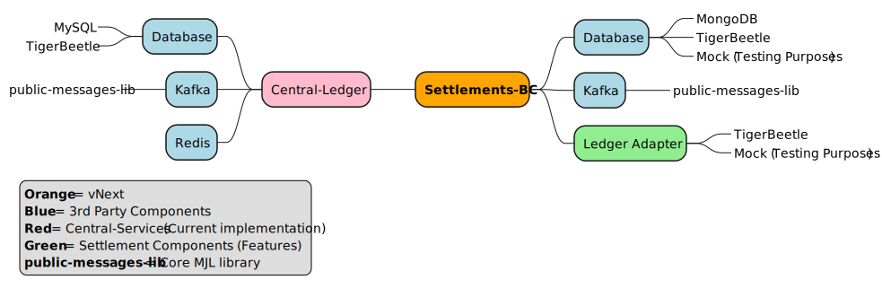

The diagram below illustrates the various components required by Settlement to function in a vNext environment:
## 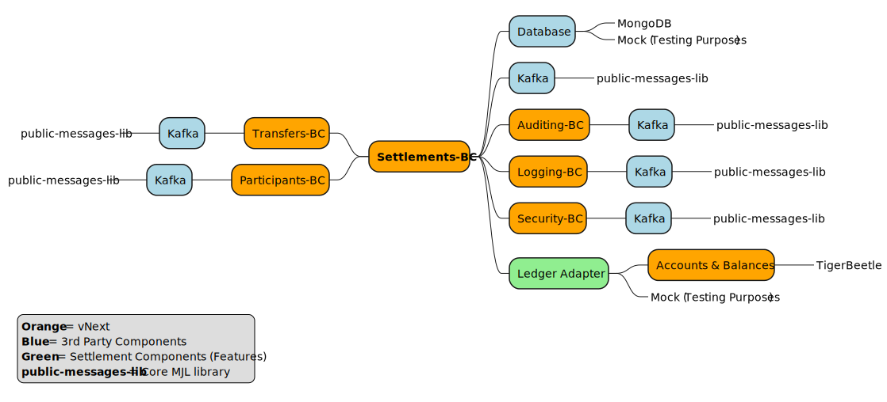

> One would either run Transfer-BC or Central-Ledger BC, but not both. 

> The components on the left are client components for the Settlement-BC, whilst the components on the right represent core Settlement compments.  

## 1. Creating Settlement Transfers
This process is initiated when the Settlement component receives cleared Transfers to settle.  
The process creates settlement obligations between the payer (debtor) and payee (creditor) DFSPs 
by creating settlement transfers which are deterministically allocated to settlement batches. 

## `TransferPreparedEvtPayload` from Transfers BC
The diagram below illustrates how Transfers that were cleared by the **Transfers BC** get settled:
## 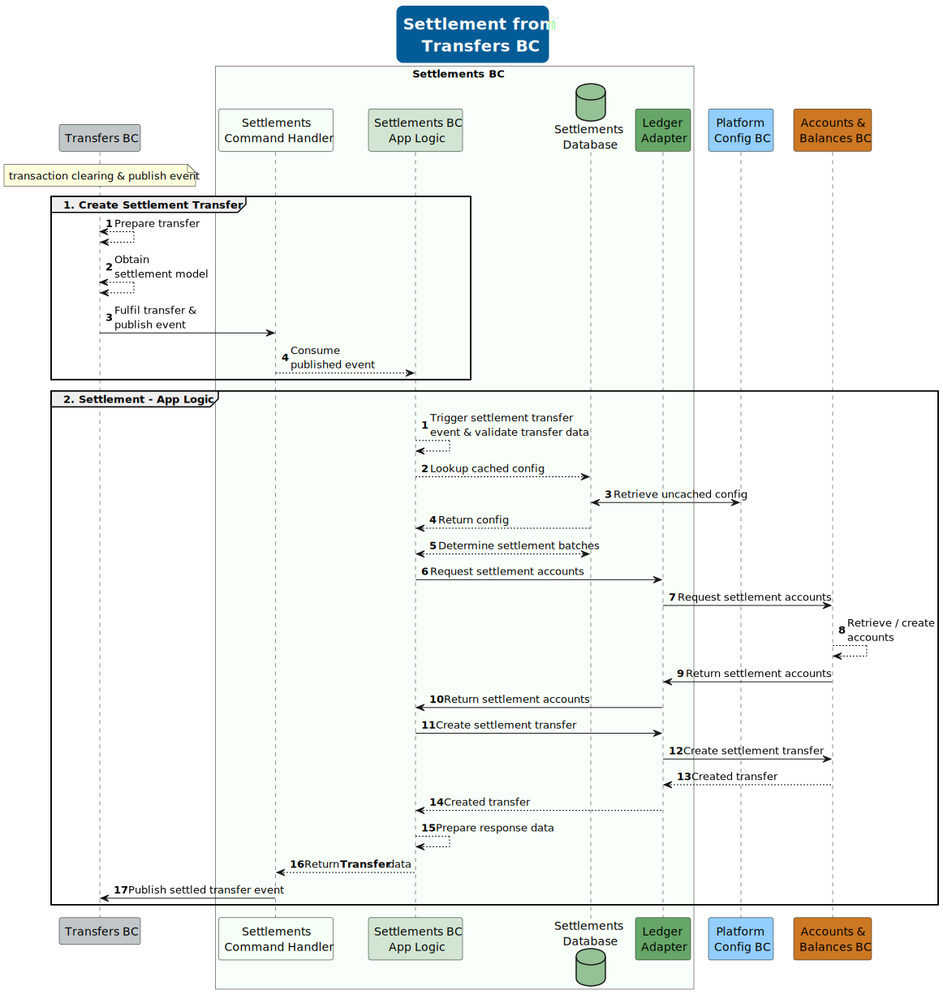

### `TransferPreparedEvtPayload` from Central-Ledger
The diagram below illustrates how Transfers that were cleared by the **Central-Ledger** service get settled:
## 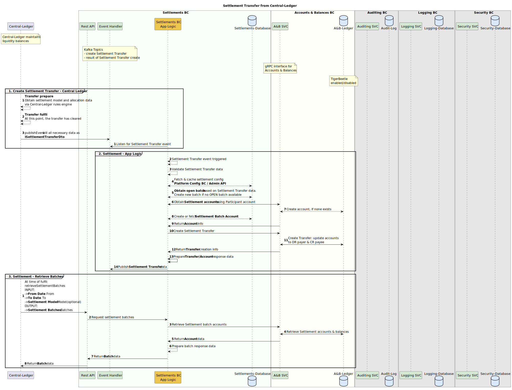

### Settlement Transfer Model
A Settlement Transfer is the data object shared between the Settlement service and the service that it interacts with (e.g. Central-Ledger or the Transfers BC).    
The table below gives a view of the Settlement Transfer fields:

| Field              | Definition                         | Description                                                                                                                                        |
|--------------------|------------------------------------|----------------------------------------------------------------------------------------------------------------------------------------------------|
| `id`               | `null / string`                    | The global unique identifier for settlement transfer. Assigned by Settlement                                                                       |
| `transferId`       | `string`                           | An external id used by the external services (Central-Ledger / Transfers BC) used to uniquely identify a transfer                                  |
| `payerFspId`       | `string`                           | The participant account to be debited. The actual settlement account will be derived from the provided debit account during a transfer             |
| `payeeFspId`       | `string`                           | The participant account to be credited. The actual settlement account will be derived from the provided credit account during a transfer           |
| `currencyCode`     | `string`                           | The currency code for a settlement transfer as described in ISO-4217                                                                               |
| `amount`           | `string`                           | The transfer amount in minor denomination format (cents/fills) as text (`string)                                                                   |
| `timestamp`        | `number`                           | The timestamp of the original committed/fulfilled transfer. Settlement batch processing make use of the timestamp to allocate transfers to batches |
| `settlementModel`  | `string`                           | The settlement model assigned to the transfer (Examples include `DEFAULT`, `FX` and `REMITTENCE`). Mandatory for a transfer create                 |
* See `ITransferDto` at https://github.com/mojaloop/settlements-bc/blob/main/packages/public-types-lib/src/index.ts

### Settlement Batch Account Model
A settlement batch account is an account created for a participant for a batch.
The `participantId` is used to link the participant account with the settlement batch account.
The table below gives a view of the Settlement Batch Account fields:

| Field              | Definition                    | Description                                                                                                                                            |
|--------------------|-------------------------------|--------------------------------------------------------------------------------------------------------------------------------------------------------|
| `id`               | `string`                      | The global unique identifier for settlement batch account. Assigned by Settlement                                                                      |
| `accountExtId`     | `string`                      | The external account id the batch account is associated with. The external id would be the unique id in the ledger system e.g Accounts and Balances BC |
| `participantId`    | `string`                      | The id used to identify the participant account in the external services (Central-Ledger / Participants BC) used to identify an account                |
| `currencyCode`     | `string`                      | The currency code for a settlement batch account as described in ISO-4217                                                                              |
| `debitBalance`     | `string`                      | The settlement account debit balance amount in minor denomination format (cents/fills) as text (`string`)                                              |
| `creditBalance`    | `string`                      | The settlement account credit balance amount in minor denomination format (cents/fills) as text (`string`)                                             |
* See `ISettlementBatchAccount` at https://github.com/mojaloop/settlements-bc/blob/main/packages/public-types-lib/src/index.ts

### Settlement Batch Model
A settlement batch is a collection of Settlement Transfers that should be settled together. 
The table below gives a view of the Settlement Batch fields:

| Field             | Definition                                  | Description                                                                                                                                                                                         |
|-------------------|---------------------------------------------|-----------------------------------------------------------------------------------------------------------------------------------------------------------------------------------------------------|
| `id`              | `null / string`                             | The global unique identifier for settlement batch account. Assigned by Settlement                                                                                                                   |
| `timestamp`       | `number`                                    | The timestamp for when the settlement batch account was created                                                                                                                                     |
| `settlementModel` | `string`                                    | The settlement model assigned to the transfer at time of transfer prepare (outside of the Settlement service) (Examples include `DEFAULT`, `FX` and `REMITTENCE`). Mandatory for a transfer create. |
| `currencyCode`    | `string`                                    | The currency for a settlement batch as described in ISO-4217                                                                                                                                        |
| `batchName`       | `string`                                    | The name of the settlement batch, which includes model, currency and batch expiration date. Example include `USD.2023.1.26.13.33`                                                                   |
| `batchSequence`   | `number`                                    | The sequence for a batch. See batch assignment section                                                                                                                                              |
| `state`           | `OPEN" / "CLOSED" / "DISPUTED" / "SETTLED"` | See section [Batch State Machine](#4-settlement-state-machine)                                                                                                                                      |
| `accounts`        | `ISettlementBatchAccount[]`                 | The settlement participant accounts associated with the batch.                                                                                                                                      |
* See `ISettlementBatch` at https://github.com/mojaloop/settlements-bc/blob/main/packages/public-types-lib/src/index.ts

### Settlement Model Relationships
The diagram below illustrates the relationships between persisted settlement data:
## 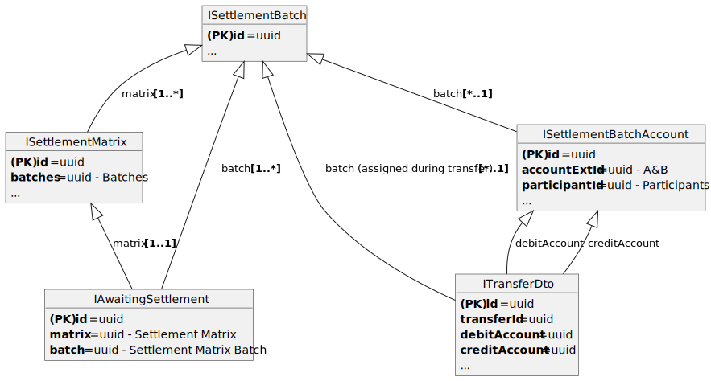

## 2. Fulfilling Settlement Obligations
This process begins with requesting the settlement matrix for a specified timespan __(Generate Settlement Matrix)__.    

For a specified period of time, requesting the settlement matrix closes any open batches and
returns a result set of all the DR/CR balances of the settlement batches.  
The purpose of the matrix is to view the DR/CR balances for batches, and the payer/payee
settlement account balances for those batches.  

Once the batches are closed, the external services (i.e. Central-Ledger, Transfers BC, Participants BC) 
that interfaces with the Settlement-BC gets notified of the settlement transfers being fulfilled.

### Settlement Matrix - Dynamic
The flow below is how a Settlement Matrix is created using a `DYNAMIC` settlement matrix:
## 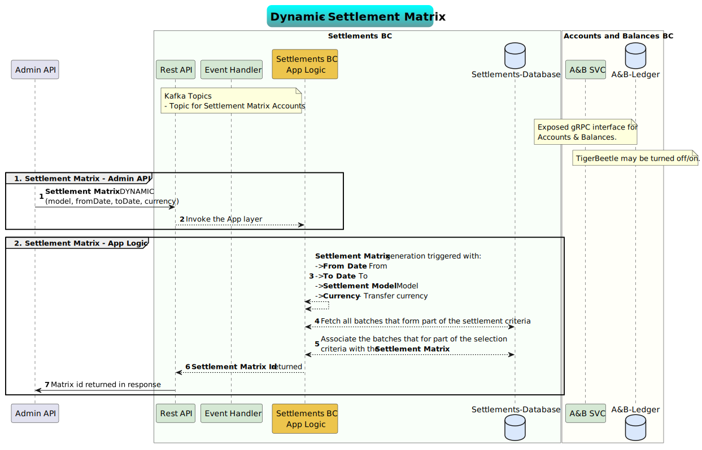

### Settlement Matrix - Static
The flow below is how a Settlement Matrix is created using a `STATIC` settlement matrix (statically allocated batches):
## 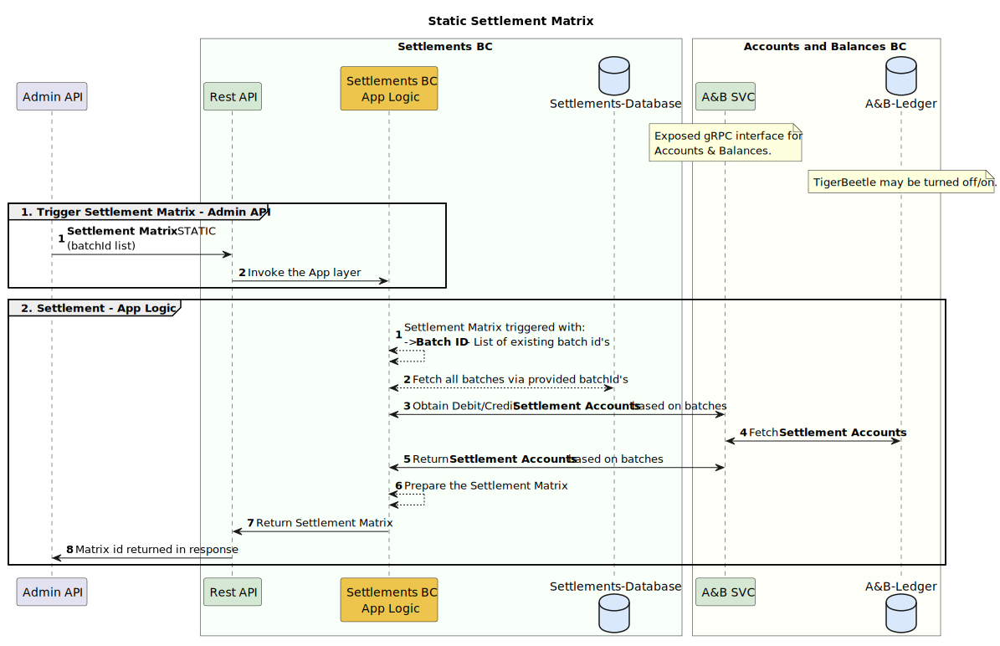

### Settlement Matrix - Close
The flow below is how a Settlement Matrix is `CLOSED`, based on an existing settlement matrix id:
## 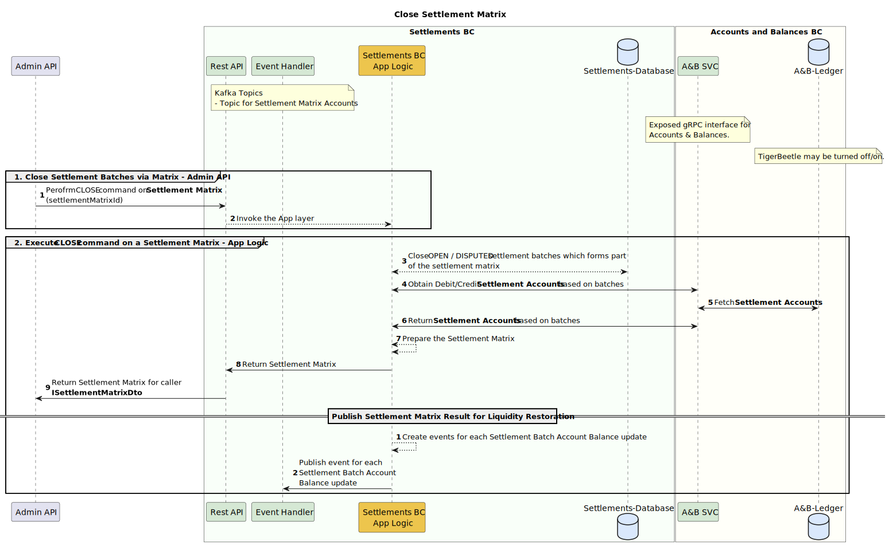

### Settlement Matrix - Dispute
The flow below is how a Settlement Matrix is `DISPUTED`, based on an existing settlement matrix id:
## 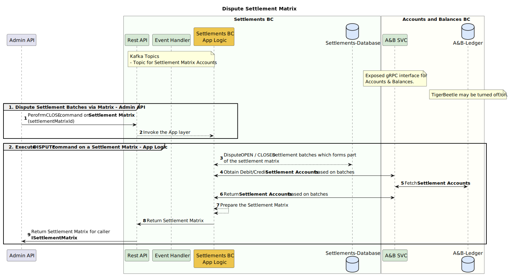

### Settlement Matrix - Settle
The flow below is how a Settlement Matrix is `SETTLED`, based on an existing settlement matrix id:
## 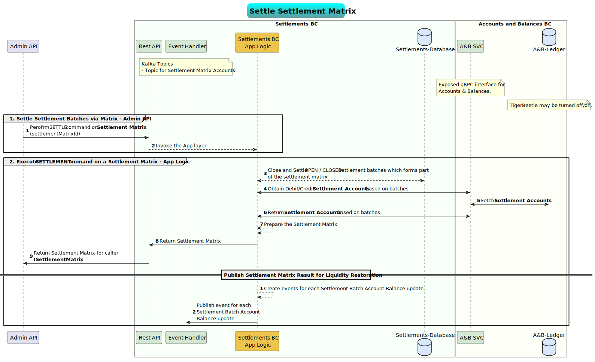

### Settlement Matrix Model
The settlement matrix is the data object shared between Settlement and the external services during settlement matrix generation.
The table below illustrates the Settlement Matrix fields:

| Field                         | Definition                              | Description                                                                                                                                                                                                                                         |
|-------------------------------|-----------------------------------------|-----------------------------------------------------------------------------------------------------------------------------------------------------------------------------------------------------------------------------------------------------|
| `id`                          | `string`                                | The global unique identifier for settlement matrix. Generated by Settlement                                                                                                                                                                         |
| `createdAt`                   | `number`                                | The timestamp when the matrix was created                                                                                                                                                                                                           |
| `updatedAt`                   | `number`                                | The timestamp when the matrix was last updated                                                                                                                                                                                                      |
| `dateFrom`                    | `number / null`                         | The date to which to generate the settlement matrix from                                                                                                                                                                                            |
| `dateTo`                      | `number / null`                         | The date to which to generate the settlement matrix until                                                                                                                                                                                           |
| `currencyCode`                | `string`                                | The currency code as described in ISO-4217                                                                                                                                                                                                          |
| `settlementModel`             | `string / null`                         | The settlement model for which the settlement model is generated                                                                                                                                                                                    |
| `batches`                     | `ISettlementMatrixBatch[]`              | The settlement matrix batches that were processed                                                                                                                                                                                                   |
| `participantBalances`         | `ISettlementMatrixParticipantBalance[]` | The debit and credit balances for a participant.                                                                                                                                                                                                    |
| `participantBalancesDisputed` | `ISettlementMatrixParticipantBalance[]` | The disputed debit and credit balances for a participant.                                                                                                                                                                                           |
| `state`                       | `"IDLE" / "BUSY" / "SETTLED"`           | See section [Batch State Machine](#5-settlement-state-machine)                                                                                                                                                                                      |
| `type`                        | `"STATIC" / "DYNAMIC"`                  | The type of matrix. `STATIC` = A matrix that has one or many batches statically allocated (batches are not assigned automatically), `DYNAMIC` = A matrix that obtains batches via lookup criteria (currency, settlementModel, fromDate, toDate etc) |
| `generationDurationSecs`      | `number`                                | The time in seconds it took to generate the settlement matrix                                                                                                                                                                                       |
| `totalDebitBalance`           | `string`                                | The sum of all batch debit balances that hasn't been disputed.                                                                                                                                                                                      |
| `totalCreditBalance`          | `string`                                | The sum of all batch credit balances that hasn't been disputed.                                                                                                                                                                                     |
| `totalDebitBalanceDisputed`   | `string`                                | The sum of all batch debit balances that has been disputed.                                                                                                                                                                                         |
| `totalCreditBalanceDisputed`  | `string`                                | The sum of all batch credit balances that has been disputed.                                                                                                                                                                                        |
* See `ISettlementMatrix` at https://github.com/mojaloop/settlements-bc/blob/main/packages/public-types-lib/src/index.ts

### Settlement Matrix Batch Model
The settlement matrix batch data object is a child object for the [Settlement Matrix Model](#settlement-matrix-model)
The Settlement Matrix Batch has numerous Settlement Accounts associated with the batch. 
The table below illustrates the Settlement Matrix Batch fields:

| Field                | Definition                                                           | Description                                                                                                                                                                                                                                                                                                     |
|----------------------|----------------------------------------------------------------------|-----------------------------------------------------------------------------------------------------------------------------------------------------------------------------------------------------------------------------------------------------------------------------------------------------------------|
| `id`                 | `string`                                                             | The global unique identifier for settlement matrix batch. Generated by Settlement                                                                                                                                                                                                                               |
| `name`               | `string`                                                             | The name of the batch `e.g DEFAULT.USD:USD.2023.1.24.14.28.1`                                                                                                                                                                                                                                                   |
| `batchDebitBalance`  | `string`                                                             | The settlement batch debit balance amount in minor denomination format (cents/fills) as text (`string)                                                                                                                                                                                                          |
| `batchCreditBalance` | `string`                                                             | The settlement batch credit balance amount in minor denomination format (cents/fills) as text (`string)                                                                                                                                                                                                         |
| `state`              | `"OPEN" / "DISPUTED" / "SETTLED" / "CLOSED" / "AWAITING_SETTLEMENT"` | The status for a settlement batch. `OPEN` = Batch is open and may receive settlement transfers, `CLOSED` = Batch is closed and no more transactions will be allocated to a closed batch, `DISPUTED` = Batch have been disputed (and will not be settled), `SETTLED` = Batch is settled and considered as final. |
| `batchAccounts`      | `ISettlementMatrixBatchAccount[]`                                    | The settlement batch accounts linked to the batch.                                                                                                                                                                                                                                                              |
* See `ISettlementMatrixBatch` at https://github.com/mojaloop/settlements-bc/blob/main/packages/public-types-lib/src/index.ts

### Settlement Matrix Batch Account Model
The Settlement Matrix Batch Account belongs to a [Settlement Matrix Batch](#settlement-matrix-batch-model).
The table below illustrates the Settlement Matrix Batch Account fields:

| Field            | Definition | Description                                                                                                                                            |
|------------------|------------|--------------------------------------------------------------------------------------------------------------------------------------------------------|
| `id`             | `string`   | The global unique identifier for settlement batch account. Assigned by Settlement                                                                      |
| `participantId`  | `string`   | An participantId id used by the external services (Central-Ledger / Transfers BC) used to identify a settled account                                   |
| `accountExtId`   | `string`   | The external account id the batch account is associated with. The external id would be the unique id in the ledger system e.g Accounts and Balances BC |
| `debitBalance`   | `string`   | The settlement batch account debit balance amount in minor denomination format (cents/fills) as text (`string)                                         |
| `creditBalance`  | `string`   | The settlement batch account credit balance amount in minor denomination format (cents/fills) as text (`string)                                        |
* See `ISettlementMatrixBatchAccount` at https://github.com/mojaloop/settlements-bc/blob/main/packages/public-types-lib/src/index.ts

### Transfer Prepared Event Payload Model
The Transfer Prepared Event Payload Model is published at the time a 2-phase Transfer has been fulfilled. This event signifies the settlement obligation has been created as a result of a successful transfer.
The table below illustrates the Transfer Prepared Event Payload Model fields:

| Field            | Definition  | Description                                                                                                                              |
|------------------|-------------|------------------------------------------------------------------------------------------------------------------------------------------|
| `transferId`     | `string`    | An external id used by the external services (Central-Ledger / Transfers BC) used to uniquely identify a transfer                        |
| `payeeFsp`       | `string`    | An participantId id used by the external services (Central-Ledger / Transfers BC) used to identify the payer DFSP                        |
| `payerFsp`       | `string`    | An participantId id used by the external services (Central-Ledger / Transfers BC) used to identify the payee DFSP                        |
| `amount`         | `string`    | The transfer amount in minor denomination format (cents/fills) as text (`string)                                                         |
| `currencyCode`   | `string`    | The currency code as described in ISO-4217                                                                                               |
| `ilpPacket`      | `string`    | The ILP packet transmitted *(optional)*. See https://interledger.org/rfcs/0003-interledger-protocol/                                     |
| `condition`      | `string`    | The cryptographic condition set on the ILP packet by the sender *(optional)*                                                             |
| `expiration`     | `number`    | The timestamp when the transfer fulfill would have expired, which would have resulted in a rollback (no fulfill post the prepare event). |
| `extensionList`  | `extension` | The list of optional name/value pair extensions that may be added as part of the transfer fulfill *(optional)*                           |
* See `TransferPreparedEvtPayload` at https://github.com/mojaloop/platform-shared-lib/blob/main/packages/public-messages-lib/src/transfers-bc/responses.ts

### Settlement Matrix Settled Participant Event Payload Model
The Settlement Matrix Settled Participant Event Payload Model is published at the time a settlement batch have been `SETTLED` (final stage). 
This event signifies the settlement obligation has been fulfilled as a result of a successful settlement.
The table below illustrates the Settlement Matrix Settled Participant Event Payload Model fields:

The table below illustrates the Settlement Matrix Settled Event Model fields:

| Field                | Definition                                       | Description                                               |
|----------------------|--------------------------------------------------|-----------------------------------------------------------|
| `settlementMatrixId` | `string`                                         | The unique settlement matrix id that was settled          |
| `settledTimestamp`   | `number`                                         | The timestamp at which the settlement took place          |
| `participantList`    | `SettlementMatrixSettledParticipantEvtPayload[]` | The list of participants with their debit/credit balances |
* See `SettlementMatrixSettledEvt` at https://github.com/mojaloop/platform-shared-lib/blob/main/packages/public-messages-lib/src/settlements-bc/requests.ts

The table below illustrates the Settlement Matrix Settled Participant Event Payload Model fields:

| Field                  | Definition  | Description                                                                                                                            |
|------------------------|-------------|----------------------------------------------------------------------------------------------------------------------------------------|
| `participantId`        | `string`    | An participantId id used by the external services (Central-Ledger / Transfers BC) used to identify the DFSP position balance to update |
| `currencyCode`         | `string`    | The currency code as described in ISO-4217                                                                                             |
| `settledDebitBalance`  | `string`    | The net debit balance for all batches settled for the `participantId`                                                                  |
| `settledCreditBalance` | `string`    | The net credit balance for all batches settled for the `participantId`                                                                 |
* See `SettlementMatrixSettledParticipantEvtPayload` at https://github.com/mojaloop/platform-shared-lib/blob/main/packages/public-messages-lib/src/settlements-bc/requests.ts

## 3. Assigning Dynamic Settlement Batches
This section describes the process of assigning a Transfer to a batch, for settlement.

In the previous implementation, the Settlement component always assigned a Transfer to the only open settlement window at the time of settlement.  
In the new implementation, the Settlement component uses fields of a Transfer to determine the settlement batch and multiple settlement batches can be open at a time, based on the:
- Timestamp of a Transfer.
- Settlement model of a Transfer.
- Configured duration/timespan for any settlement batch.

A transaction will be allocated to a newly created batch when it falls within the time period of a batch that is already `CLOSED`. This is because Settlement batches that are in a `CLOSED` state cannot be altered.

Instead of assigning a settlement transfer to the current open settlement window, the Settlement vNext would be responsible for allocating the transfer itself.
Transfers-BC / Central-Ledger: At time of fulfil, produce an event to be consumed eventually by Settlement. 
Settlement-BC would then be responsible for allocating a transfer to a settlement batch and settlement model, independently of other components.

Late settlement transactions will be allocated to a newly created batch (since the batch for timespan X would have already been closed).
Example: 
Lets assume that the transfer timestamp for a late transaction is `2023.1.26.13.33.59`. 
The batch meant for the "late" / delayed transfer is meant for batch:
- `DEFAULT.USD:USD.2023.1.26.13.33.001`
Due to the batch being in a closed state, the following batch will be created for the transfer:
- `DEFAULT.USD:USD.2023.1.26.13.33.002`

The above ensures the requirements are met:
- Transfers will always be allocated to a batch, irrespective of the timestamp and batch statuses
- Settlement batches that are in a `CLOSED` state cannot be altered 
- Reconciliation is achieved by re-running the Settlement Matrix for the delayed transfer, which will automatically rectify settlement inconsistencies

## 4. Assigning Static Settlement Batches
This section describes the process of assigning a Batch to a static Settlement Matrix, for settlement.

It is necessary to perform commands on a statically defined batch or batches for a Settlement Matrix.
Once a Static Matrix has been created, batches may be added or removed from the static matrix.

A static settlement matrix is useful when the Hub operator knows the exact batches to be included as part of a matrix.
The static matrix is especially useful when disputing one or more batches in order to isolate those batches from other batches that may be settled.

## 5. Settlement State Machine
State transitions for settlement matrices and batches are described in the following sections.

### 5.1 Settlement Matrix
The table below illustrates the states for a settlement matrix:

| State      | Description                                                                                                       | 
|------------|-------------------------------------------------------------------------------------------------------------------|
| `IDLE`     | Matrix is awaiting input (initial state)                                                                          |
| `BUSY`     | Matrix is currently busy processing a request, all commands will be blocked until completed                       |
| `SETTLED`  | Matrix has been actioned to settled all IDLE or CLOSED batches. Once a matrix is settled, it is considered final  |

### 5.2 Settlement Matrix Batch
The table below illustrates the states for a settlement batch:

| State                 | Description                                                                                                                                                          | 
|-----------------------|----------------------------------------------------------------------------------------------------------------------------------------------------------------------|
| `OPEN`                | Batch is open and may receive settlement transfers                                                                                                                   |
| `CLOSED`              | Batch is closed and no more transactions will be allocated to the closed batch                                                                                       |
| `DISPUTED`            | Batch have been disputed. The dispute needs to be resolved before the batch can be settled                                                                           |
| `AWAITING_SETTLEMENT` | Batch has been marked for final approval, lock relationship is created between batch and matrix. Only the matrix linked to the batch is allowed to release the batch |
| `SETTLED`             | Batch is settled and considered as final                                                                                                                             |

### 5.3 Settlement Batch State Transitions
The diagram below illustrates the state transitions for a settlement batch:
## 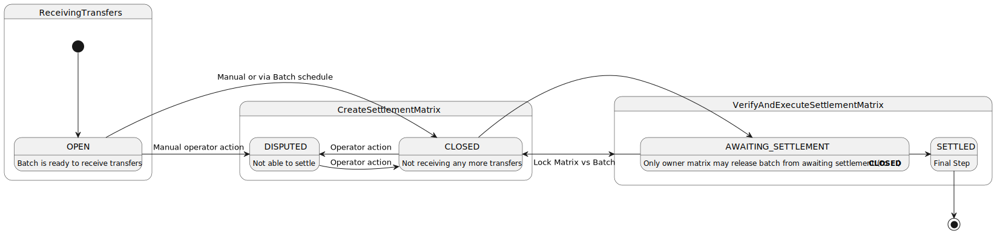

## 6. References
The following documentation provides insight into Settlements.

| Ref # | Document                                                             | Link                                                                                                                                   | 
|-------|----------------------------------------------------------------------|----------------------------------------------------------------------------------------------------------------------------------------|
| `01.` | **Technical Flows**                                                  | `*.puml`                                                                                                                               |
| `02.` | **Settlement Version 2**                                             | `../Settlement Version 2.pptx`                                                                                                         |
| `03.` | **Settlement Operational Implementation**                            | https://docs.mojaloop.io/business-operations-framework-docs/guide/SettlementBC.html#core-settlement-operations                         |
| `04.` | **Reference Architecture**                                           | https://mojaloop.github.io/reference-architecture-doc/boundedContexts/settlements/                                                     |
| `05.` | **MIRO Board (Reference Architecture)**                              | https://miro.com/app/board/o9J_lJyA1TA=/                                                                                               |
| `06.` | **Settlement Functionality in MJL**                                  | https://docs.google.com/presentation/d/19uy6pO_igmQ9uZRnKyZkXD8a8uyMKQcn/edit#slide=id.p1                                              |
| `07.` | **DA Work Sessions**                                                 | https://docs.google.com/document/d/1Nm6B_tSR1mOM0LEzxZ9uQnGwXkruBeYB2slgYK1Kflo/edit#heading=h.6w64vxvw6er4                            |
| `08.` | **Admin API - Settlement Models**                                    | https://github.com/mojaloop/mojaloop-specification/blob/master/admin-api/admin-api-specification-v1.0.md#api-resource-settlementmodels |
| `09.` | **Mojaloop Product Timeline**                                        | https://miro.com/app/board/uXjVPA3hBgE=/                                                                                               |
| `10.` | **Settlement Basic Concepts**                                        | https://docs.mojaloop.io/mojaloop-business-docs/HubOperations/Settlement/settlement-basic-concepts.html                                |
| `11.` | **Ledgers in the Hub**                                               | https://docs.mojaloop.io/mojaloop-business-docs/HubOperations/Settlement/ledgers-in-the-hub.html                                       |
| `12.` | **Mojaloop 2.0 Reference Architecture - Sheet 8**                    | https://docs.google.com/spreadsheets/d/1ITmAesHjRZICC0EUNV8vUVV8VDnKLjbSKu_dzhEa5Fw/edit#gid=580827044                                 |
| `13.` | **Change Request: Modifications to Admin API to support Settlement** | https://github.com/mojaloop/mojaloop-specification/issues/117                                                                          |

## 7. API
The following REST API endpoints exists for Settlements.

| Ref # | URL                         | Method   | Description                                                                                                                                                                                                                                                                                                                                         | 
|-------|-----------------------------|----------|-----------------------------------------------------------------------------------------------------------------------------------------------------------------------------------------------------------------------------------------------------------------------------------------------------------------------------------------------------|
| `01.` | **/matrix**                 | `POST`   | Create a settlement matrix and return the matrix UUID *(newly generated)*. Batches that match the matrix criteria will be included as part of the settlement matrix. Any newly created batches will not be automatically associated with the settlement matrix. Newly created transfers will still be allocated to batches that are not yet closed. |
| `02.` | **/matrix/:id/batches**     | `POST`   | Add a specific batch (by uuid) or batches to a `STATIC` settlement matrix.                                                                                                                                                                                                                                                                          |
| `03.` | **/matrix/:id/batches**     | `DELETE` | Remove a specific batch (by uuid) or batches from a `STATIC` settlement matrix.                                                                                                                                                                                                                                                                     |
| `04.` | **/matrix/:id/recalculate** | `POST`   | Request a re-calculation for an existing settlement matrix based on UUID. The re-calculation will include any newly created batches that match the settlement matrix criteria (`DYNAMIC` only).                                                                                                                                                     |
| `05.` | **/matrix/:id/close**       | `POST`   | Close settlement batches and settlement matrix.                                                                                                                                                                                                                                                                                                     |
| `06.` | **/matrix/:id/settle**      | `POST`   | Settle applicable settlement batches and settlement matrix. Generate a settlement matrix as response. Once a settlement batch is settled, the balances for the batches and accounts will not change. No newly created transfers will be allocated to settled batches.                                                                               |
| `07.` | **/matrix/:id/dispute**     | `POST`   | Dispute settlement batches and settlement matrix.                                                                                                                                                                                                                                                                                                   |
| `08.` | **/batches/:id**            | `GET`    | Retrieve settlement batch by UUID. The batches include the settlement accounts and balances.                                                                                                                                                                                                                                                        |
| `09.` | **/batches**                | `GET`    | Retrieve all settlement batches.                                                                                                                                                                                                                                                                                                                    |
| `10.` | **/transfers**              | `GET`    | Retrieve all settlement transfers by batch id, batch name, transfer id or matrix id.                                                                                                                                                                                                                                                                |
| `11.` | **/matrix/:id**             | `GET`    | Retrieve the settlement matrix by UUID. If the settlement matrix is not in a closed state, the batch and account balances for the open batches may change due to new transfers.                                                                                                                                                                     |

